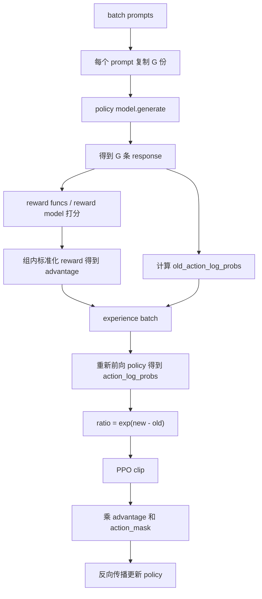

# 手撕 GRPO：从思路框架到最小 PyTorch 实现

> 对应代码：`/Users/kenneth_feng/CODE/GRPO/grpo_from_scratch/train.py` 和 `/Users/kenneth_feng/CODE/GRPO/grpo_from_scratch/reward_func.py`

这份笔记的目标不是背公式，而是让你能自己从空文件写出一个最小 GRPO trainer。你只需要抓住一句话：

**GRPO = 对同一个 prompt 采样多条回答，在组内比较谁更好，用相对优势更新模型，让好回答的 token 概率上升、坏回答的 token 概率下降。**

---

## 1. GRPO 到底在解决什么

普通监督微调 SFT 是：

```text
给定标准答案 y，让模型更像 y。
```

RLHF / RLAIF 类训练是：

```text
模型自己生成回答，奖励函数判断好坏，然后让模型更倾向于生成高奖励回答。
```

PPO 里常见做法会训练一个 value model 来估计 baseline：

```text
advantage = reward - value(prompt, response)
```

GRPO 的轻量点在于：**不用 value model**。它让同一个 prompt 下的多条回答互相当 baseline：

```text
同一个问题 q
生成 G 条回答：o1, o2, ..., oG
分别打分：r1, r2, ..., rG

组内均值：mean(r)
组内标准差：std(r)
优势：Ai = (ri - mean(r)) / (std(r) + eps)
```

所以：

- 某条回答高于组内平均，`advantage > 0`，训练会提高它的概率。
- 某条回答低于组内平均，`advantage < 0`，训练会降低它的概率。
- 同一道题内部比较，减少了不同题目难度不同带来的 reward 尺度问题。

---

## 2. 先记住整条训练流水线

最小 GRPO 一轮训练可以拆成 7 步：

```text
1. 取一个 prompt
2. 把这个 prompt 复制 G 份
3. 用当前策略模型生成 G 条 response
4. 奖励函数给每条 response 打分
5. 在这个 group 内标准化 reward，得到每条 response 的 advantage
6. 重新前向模型，计算当前 log_prob 和采样时 old_log_prob 的 ratio
7. 用 PPO clipped objective 更新模型
```

对应当前代码：

| 步骤 | 函数 | 位置 |
|---|---|---|
| 读数据 | `GSM8KDataset` | `train.py:18` |
| 保存一组采样 | `Samples` | `train.py:36` |
| 配置超参 | `GRPOArguments` | `train.py:48` |
| 初始化模型、reward、优化器 | `GRPOTrainer.__init__` | `train.py:75` |
| 对 prompt 采样 G 条回答 | `generate_samples` | `train.py:161` |
| 算 reward / advantage / old log prob | `generate_experiences` | `train.py:229` |
| 算策略损失 | `compute_loss` | `train.py:335` |
| 从 logits 中取生成 token 的 log prob | `get_action_log_probs` | `train.py:386` |
| 反传和参数更新 | `train_step` | `train.py:409` |
| 外层训练循环 | `train` | `train.py:432` |

---

## 3. 核心变量和 shape

假设：

```python
batch_size = B
num_generations = G
max_prompt_length = P
max_generate_length = A
seq_len = P + A
```

对每个 prompt 会生成 G 条回答，所以进入 loss 的真实 batch 是：

```text
B * G
```

几个核心 tensor：

| 变量 | shape | 含义 |
|---|---:|---|
| `prompt_response_ids` | `[B*G, P+A]` | prompt 和 response 拼起来的 token id |
| `response_ids` | `[B*G, A]` | 只包含生成部分 |
| `attention_mask` | `[B*G, P+A]` | 非 pad token 为 1 |
| `action_mask` | `[B*G, A]` | response 中参与 loss 的 token 为 1 |
| `old_action_log_probs` | `[B*G, A]` | 采样时策略模型对生成 token 的 log probability |
| `action_log_probs` | `[B*G, A]` | 当前策略模型对同一批 token 的 log probability |
| `advantages` | `[B*G]` | 每条 response 一个优势值 |
| `ref_action_log_probs` | `[B*G, A]` | reference model 的 log probability，可选 |

最重要的心智模型：

```text
advantage 是句子级别的，但 loss 是 token 级别的。
所以一条回答中的所有有效 token 共享同一个 advantage。
```

---

## 4. 数据集：每条样本只需要 prompt 和 answer

当前代码：

```python
class GSM8KDataset(Dataset):
    def __init__(self, data_path, tokenizer):
        self.tokenizer = tokenizer
        data = load_dataset(data_path)
        self.data = data["train"]

    def __len__(self):
        return len(self.data)

    def __getitem__(self, index):
        sample = self.data[index]
        answer = sample["answer_only"]
        prompt = sample["question_zh-cn"]
        return {"prompt": prompt, "answer": answer}
```

GRPO 本身不要求一定有标准答案。只要你有 reward 函数就行。

但数学题场景通常会保留 `answer`，因为可以写一个 correctness reward：

```text
模型输出 answer 标签里的结果 == 标准答案，则给高分。
```

---

## 5. 奖励函数：先用规则奖励跑通

`reward_func.py` 里有 4 个奖励函数：

```python
correctness_reward  # 答案完全正确：2.0
digit_reward        # 提取出的答案是数字：0.5
hard_format_reward  # 完整匹配 <think>...</think><answer>...</answer> 格式：0.5
mark_reward         # 每个关键标签存在就给一点分，缓解格式奖励太稀疏
```

为什么不只用 correctness reward？

因为一开始模型很可能答不对，所有 reward 都是 0，组内 advantage 也接近 0，训练信号会很弱。

所以实际经常会加一些稠密奖励：

- 格式对不对。
- 有没有输出数字。
- 最终答案是否正确。
- 是否包含指定结构。

奖励函数接口统一成：

```python
def reward_func(prompts, responses, answers):
    return list_of_rewards
```

返回长度必须等于 `responses` 的长度。

---

## 6. 采样：同一个 prompt 生成一个 group

代码在 `generate_samples`。

核心动作是把同一个 prompt 复制 `num_generations` 份：

```python
inputs = tokenizer(
    [input_text] * args.num_generations,
    padding="max_length",
    max_length=args.max_prompt_length,
    truncation=True,
    return_tensors="pt",
)
```

然后一次 generate 出 G 条回答：

```python
prompt_response_ids = model.generate(
    **inputs.to(device),
    max_new_tokens=args.max_generate_length,
    temperature=0.9,
    top_p=1,
    top_k=50,
)
```

这里必须开采样，让同一个 prompt 的多条回答有差异。否则 G 条回答都一样，reward 一样，advantage 接近 0。

生成后做三件事：

### 6.1 补齐到固定长度

```python
max_length = max_prompt_length + max_generate_length
```

如果生成长度不足，就 pad 到固定长度，方便后面 `torch.cat`。

### 6.2 得到 response_ids

```python
response_ids = prompt_response_ids[:, prompt_ids.size(1):]
```

模型生成返回的是：

```text
prompt tokens + response tokens
```

训练时只更新 response 部分，所以要切出来。

### 6.3 构造 action_mask

```python
action_mask = (
    response_ids.ne(tokenizer.eos_token_id)
    & response_ids.ne(tokenizer.pad_token_id)
).to(dtype=torch.long)
```

`action_mask` 用来告诉 loss：

```text
只有真正生成的 response token 参与策略梯度；
pad token 不参与；
eos token 后面不参与。
```

---

## 7. old log prob：记录采样时模型觉得这些 token 有多可能

PPO / GRPO 更新时，需要比较：

```text
当前模型对这批 response token 的概率
采样时旧模型对这批 response token 的概率
```

重要性采样 ratio：

```text
ratio = exp(new_log_prob - old_log_prob)
```

当前代码在 `generate_experiences` 中采样后立刻记录旧概率：

```python
old_action_log_probs = self.get_action_log_probs(
    self.model,
    prompt_response_ids,
    attention_mask,
    num_actions,
)
```

如果 `num_iterations > 1`，同一批经验会被重复训练多次。这时 `old_action_log_probs` 必须固定为采样时的旧策略概率。

如果 `num_iterations == 1`，代码里直接用当前 log prob detach 也可以：

```python
old_action_log_probs = (
    inputs["old_action_log_probs"]
    if self.args.num_iterations > 1
    else action_log_probs.detach()
)
```

---

## 8. 怎样从 logits 里取出生成 token 的 log_prob

这是手撕 GRPO 最容易卡住的地方。

语言模型输出：

```text
logits[:, t, :] 预测的是 input_ids[:, t+1]
```

所以要错位：

```python
logits = model(input_ids, attention_mask=attention_mask).logits
log_probs = F.log_softmax(logits[:, :-1, :], dim=-1)
labels = input_ids[:, 1:]
token_log_probs = log_probs.gather(
    dim=-1,
    index=labels.unsqueeze(-1),
).squeeze(-1)
```

解释一下：

```text
log_probs: [batch, seq_len-1, vocab_size]
labels:    [batch, seq_len-1]

gather 的作用：
对每个位置，从 vocab_size 维度取出真实出现的 token 的 log_prob。
```

最后只保留 response 部分：

```python
action_log_probs = token_log_probs[:, -num_actions:]
```

这就得到：

```text
[batch, response_len]
```

---

## 9. 组内 reward 标准化：GRPO 的灵魂

对同一个 prompt 的 G 条回答，先收集每个奖励函数的分数：

```python
rewards_per_func = torch.zeros(num_reward_funcs, num_generations)
```

多个奖励函数按权重合并：

```python
rewards = rewards_per_func * reward_weights[:, None]
rewards = rewards.sum(dim=0)
```

得到：

```text
rewards: [G]
```

然后组内标准化：

```python
mean_group_rewards = rewards.mean()
std_group_rewards = rewards.std()
advantages = (rewards - mean_group_rewards) / (std_group_rewards + 1e-8)
```

例子：

```text
同一道题生成 4 条回答，reward = [2.5, 0.5, 0.5, 1.0]
mean = 1.125
std 约为 0.946
advantage 约为 [1.45, -0.66, -0.66, -0.13]
```

于是第一条会被增强，后面几条会被压低。

注意：如果 G 条回答 reward 完全一样，那么所有 advantage 都接近 0。这说明这个 prompt 当前没有提供有效相对偏好信号。

---

## 10. GRPO loss：PPO clipped objective 的最小版

当前实现的核心 loss：

```python
ratio = torch.exp(action_log_probs - old_action_log_probs)
clipped_ratio = torch.clamp(ratio, 1 - clip_eps, 1 + clip_eps)

loss1 = ratio * advantages.unsqueeze(1)
loss2 = clipped_ratio * advantages.unsqueeze(1)
per_token_loss = -torch.min(loss1, loss2)
per_token_loss = per_token_loss * action_mask

loss = per_token_loss.sum(dim=1) / action_mask.sum(dim=1)
loss = loss.mean()
```

把它翻译成人话：

```text
如果 advantage > 0：
    希望提高这条 response 的 token 概率。
    但 ratio 不能涨得太夸张，超过 1+eps 就 clip。

如果 advantage < 0：
    希望降低这条 response 的 token 概率。
    但 ratio 不能降得太夸张，低于 1-eps 就 clip。
```

为什么前面有负号？

因为优化器默认最小化 loss，而策略目标是最大化：

```text
maximize min(ratio * A, clipped_ratio * A)
```

所以代码写成：

```python
loss = -objective
```

---

## 11. 可选 KL：限制模型不要偏离原模型太远

当前代码里：

```python
if args.beta != 0.0:
    ref_model = deepcopy(model)
    ref_model.eval()
```

`ref_model` 是冻结的参考模型，通常就是训练开始前的策略模型。

KL 惩罚项：

```python
log_ratio = ref_action_log_probs - action_log_probs
k3 = log_ratio.exp() - 1 - log_ratio
per_token_loss = per_token_loss + beta * k3
```

直觉：

```text
reward 会推着模型往高分回答方向走；
KL 会拉住模型，避免它为了刷 reward 把语言能力训坏。
```

当前默认：

```python
beta = 0.0
```

也就是不启用参考模型。

---

## 12. 训练循环：采样和更新是分开的

`train` 里的节奏是：

```text
for epoch:
    for batch in dataloader:
        experiences = generate_experiences(batch)
        放进 input_buffer

        如果攒够 gradient_accumulation_steps:
            for num_iterations:
                for buffer 中的每批 experience:
                    train_step()
```

这里有两个容易混的概念：

### 12.1 gradient_accumulation_steps

显存不够时，不能一次放很大 batch，就多次 backward，最后再 optimizer.step。

代码里：

```python
loss = loss / gradient_accumulation_steps
loss.backward()

if (step + 1) % gradient_accumulation_steps == 0:
    optimizer.step()
    optimizer.zero_grad()
```

### 12.2 num_iterations

同一批采样经验重复训练几轮。

```python
num_iterations = 1
```

最简单，采样一次，只训练一次。

如果设置成大于 1，就更接近 PPO 的多 epoch update，这时 `old_action_log_probs` 的固定就更重要。

---

## 13. 从零手写 GRPO 的最小代码骨架

你可以按这个顺序写，基本不会乱：

```python
class GRPOTrainer:
    def __init__(self, model, tokenizer, reward_funcs, args, train_dataset):
        self.model = model.to(args.device)
        self.tokenizer = tokenizer
        self.reward_funcs = reward_funcs
        self.args = args
        self.optimizer = torch.optim.AdamW(model.parameters(), lr=args.lr)

        if args.beta > 0:
            self.ref_model = deepcopy(model).eval()
        else:
            self.ref_model = None
```

第一步，写采样：

```python
def generate_samples(self, batch):
    prompts = batch["prompt"]
    answers = batch.get("answer", [None] * len(prompts))

    all_samples = []
    for prompt, answer in zip(prompts, answers):
        text = tokenizer.apply_chat_template(
            [{"role": "user", "content": prompt}],
            tokenize=False,
            add_generation_prompt=True,
        )

        model_inputs = tokenizer(
            [text] * args.num_generations,
            padding="max_length",
            max_length=args.max_prompt_length,
            truncation=True,
            return_tensors="pt",
        ).to(args.device)

        ids = model.generate(
            **model_inputs,
            max_new_tokens=args.max_generate_length,
            do_sample=True,
            temperature=0.9,
            top_k=50,
        )

        # pad/truncate 到 prompt_len + response_len
        # 切出 response_ids
        # 构造 attention_mask/action_mask
        # 返回 Samples
```

第二步，写 log prob：

```python
def get_action_log_probs(self, model, input_ids, attention_mask, num_actions):
    logits = model(input_ids, attention_mask=attention_mask).logits
    log_probs = F.log_softmax(logits[:, :-1, :], dim=-1)
    labels = input_ids[:, 1:]
    token_log_probs = log_probs.gather(-1, labels.unsqueeze(-1)).squeeze(-1)
    return token_log_probs[:, -num_actions:]
```

第三步，写 reward 和 advantage：

```python
def compute_rewards_and_advantages(self, samples):
    response_texts = tokenizer.batch_decode(samples.response_ids, skip_special_tokens=True)
    prompt_texts = [samples.prompt] * len(response_texts)
    answers = [samples.answer] * len(response_texts)

    rewards_per_func = []
    for reward_func in self.reward_funcs:
        rewards_per_func.append(reward_func(prompt_texts, response_texts, answers))

    rewards = torch.tensor(rewards_per_func, device=args.device).sum(dim=0)
    advantages = (rewards - rewards.mean()) / (rewards.std() + 1e-8)
    return rewards, advantages
```

第四步，写 experience：

```python
def generate_experiences(self, batch):
    samples_list = self.generate_samples(batch)

    all_ids = []
    all_masks = []
    all_action_masks = []
    all_old_log_probs = []
    all_advantages = []

    for samples in samples_list:
        old_log_probs = self.get_action_log_probs(
            self.model,
            samples.prompt_response_ids,
            samples.attention_mask,
            samples.num_actions,
        )
        rewards, advantages = self.compute_rewards_and_advantages(samples)

        all_ids.append(samples.prompt_response_ids)
        all_masks.append(samples.attention_mask)
        all_action_masks.append(samples.action_mask)
        all_old_log_probs.append(old_log_probs)
        all_advantages.append(advantages)

    return {
        "prompt_response_ids": torch.cat(all_ids, dim=0),
        "attention_mask": torch.cat(all_masks, dim=0),
        "action_mask": torch.cat(all_action_masks, dim=0),
        "old_action_log_probs": torch.cat(all_old_log_probs, dim=0),
        "advantages": torch.cat(all_advantages, dim=0),
    }
```

第五步，写 loss：

```python
def compute_loss(self, batch):
    ids = batch["prompt_response_ids"]
    attention_mask = batch["attention_mask"]
    action_mask = batch["action_mask"]
    old_log_probs = batch["old_action_log_probs"]
    advantages = batch["advantages"]

    num_actions = action_mask.size(1)
    log_probs = self.get_action_log_probs(self.model, ids, attention_mask, num_actions)

    ratio = torch.exp(log_probs - old_log_probs)
    clipped_ratio = torch.clamp(ratio, 1 - args.clip_eps, 1 + args.clip_eps)

    objective = torch.min(
        ratio * advantages[:, None],
        clipped_ratio * advantages[:, None],
    )

    loss = -objective
    loss = loss * action_mask
    loss = loss.sum(dim=1) / action_mask.sum(dim=1).clamp(min=1)
    return loss.mean()
```

第六步，写训练：

```python
for batch in dataloader:
    experiences = trainer.generate_experiences(batch)
    loss = trainer.compute_loss(experiences)
    loss.backward()
    optimizer.step()
    optimizer.zero_grad()
```

这就是最小 GRPO。

---

## 14. 手撕时最容易犯的 10 个错误

### 14.1 忘记开采样

如果 `generate` 是贪心解码，同一个 prompt 复制 G 份很可能生成完全一样的回答。

应该使用：

```python
do_sample=True
temperature=0.7 或 0.9
top_p / top_k
```

当前代码设置了 `temperature/top_k`，但建议显式加上 `do_sample=True`。

### 14.2 把 prompt token 也算进 loss

GRPO 训练的是模型生成的 response，不应该优化 prompt 部分。

所以必须有：

```python
response_ids = prompt_response_ids[:, prompt_len:]
action_log_probs = token_log_probs[:, -num_actions:]
```

### 14.3 logits 和 labels 没有错位

错误写法：

```python
logits 对 input_ids 同位置 gather
```

正确写法：

```python
logits[:, :-1, :] 预测 input_ids[:, 1:]
```

### 14.4 advantage shape 没有广播

`advantages` 是 `[B*G]`，token loss 是 `[B*G, A]`。

要写：

```python
advantages.unsqueeze(1)
```

### 14.5 没有 mask pad token

如果不乘 `action_mask`，pad token 会污染 loss。

### 14.6 reward 全一样

如果一个 group 内 reward 全是 0，advantage 也几乎全是 0。

解决：

- 增加 `num_generations`。
- 增加稠密奖励，比如格式、数字、步骤结构。
- 提高采样温度，让回答更有差异。

### 14.7 reward 标准差为 0

必须加 epsilon：

```python
advantages = (rewards - rewards.mean()) / (rewards.std() + 1e-8)
```

### 14.8 生成后没有固定长度，cat 失败

不同回答生成长度不同，拼 batch 前要 pad 到一致长度。

### 14.9 reference model 也被训练了

如果启用 KL，`ref_model` 必须冻结：

```python
ref_model = deepcopy(model)
ref_model.eval()
for p in ref_model.parameters():
    p.requires_grad_(False)
```

当前代码 `eval()` 了，但如果你追求更稳，可以显式关闭梯度。

### 14.10 空 response 导致除零

当前代码：

```python
loss = per_token_loss.sum(dim=1) / action_mask.sum(dim=1)
```

更稳的写法：

```python
loss = per_token_loss.sum(dim=1) / action_mask.sum(dim=1).clamp(min=1)
```

---

## 15. 当前代码可以改进的小点

这些不是理解 GRPO 的必要条件，但自己写时建议顺手修掉。

### 15.1 `generate` 建议显式设置 `do_sample=True`

```python
prompt_response_ids = self.model.generate(
    **inputs.to(self.args.device),
    max_new_tokens=self.args.max_generate_length,
    do_sample=True,
    temperature=0.9,
    top_p=1.0,
    top_k=50,
)
```

### 15.2 tokenizer 可能没有 pad_token

很多 decoder-only 模型没有 pad token。建议初始化时加：

```python
if tokenizer.pad_token_id is None:
    tokenizer.pad_token = tokenizer.eos_token
```

### 15.3 `num_actions` 更准确应来自 response 长度

当前：

```python
num_actions = action_mask.size(1)
```

这是最大 response 长度，不是每条样本的真实有效 token 数。因为有 `action_mask`，loss 仍然可以工作。

### 15.4 reward 正则表达式要允许换行

当前：

```python
pattern = r"^<think>\n.*?\n</think>\n<answer>\n.*?\n</answer>\n$"
```

Python 的 `.` 默认不匹配换行，多行思考可能匹配失败。可以写：

```python
re.match(pattern, response, flags=re.DOTALL)
```

### 15.5 `writer` 是全局变量

`train_step` 中直接用 `writer`，如果从别的文件 import trainer，可能会报错。更干净的做法是在 `__init__` 里：

```python
self.writer = SummaryWriter(...)
```

---

## 16. 一张总图



---

## 17. 你真正需要背下来的最小公式

### 17.1 组内 advantage

```text
Ai = (ri - mean({r1, ..., rG})) / (std({r1, ..., rG}) + eps)
```

### 17.2 token ratio

```text
ratio_i,t = exp(log pi_theta(o_i,t | q, o_i,<t) - log pi_old(o_i,t | q, o_i,<t))
```

### 17.3 clipped objective

```text
J_i,t = min(ratio_i,t * Ai, clip(ratio_i,t, 1-eps, 1+eps) * Ai)
```

### 17.4 loss

```text
loss = - mean_over_valid_tokens(J_i,t)
```

可选 KL：

```text
loss = loss + beta * KL(policy || reference)
```

---

## 18. 最后用一句话复述

GRPO 的实现并不神秘：

```text
同题多答 -> 打分 -> 组内归一化成 advantage -> 取生成 token 的 log_prob -> PPO clip loss -> 只在 response token 上反传。
```

只要你能写出这 5 个函数，就已经能手撕最小 GRPO：

```python
generate_samples()
get_action_log_probs()
generate_experiences()
compute_loss()
train()
```

建议练习顺序：

```text
第 1 遍：不加 KL，不加 reward model，只用规则奖励。
第 2 遍：加入 gradient accumulation 和 checkpoint。
第 3 遍：加入 reference model 和 KL。
第 4 遍：把 reward 函数替换成 reward model 或 LLM judge。
```

