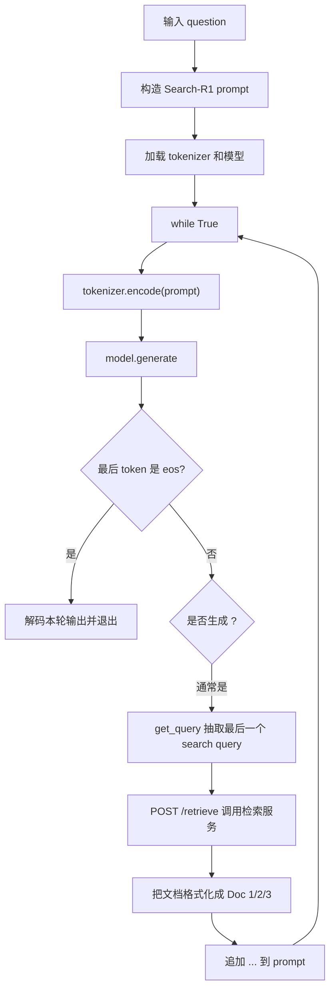

# Search-R1 `infer.py` 代码讲解

> 项目：Search-R1  
> 源码位置：`/Users/kenneth_feng/CODE/Search-R1-main/infer.py`  
> 笔记目标：理解 Search-R1 推理阶段如何让模型在生成过程中主动调用搜索引擎，并把检索结果拼回上下文继续推理。

---

## 1. 这个文件整体在做什么

`infer.py` 是 Search-R1 的单问题推理脚本。

它不是训练脚本，而是用已经训练好的 Search-R1 模型做一次交互式推理。核心流程是：

```text
输入问题
 -> 构造提示词，要求模型使用 <think>、<search>、<information>、<answer> 标签
 -> 加载 tokenizer 和 causal LM
 -> 模型开始生成
 -> 如果生成到 </search>，说明模型想调用搜索引擎
 -> 从 <search>...</search> 中抽取 query
 -> 请求本地检索服务 http://127.0.0.1:8000/retrieve
 -> 把检索结果包装成 <information>...</information>
 -> 追加到 prompt 后面
 -> 模型继续生成
 -> 如果生成到 eos，说明最终回答结束
```

一句话：

```text
infer.py = 让 LLM 边想边搜的多轮推理循环。
```

---

## 2. 运行前需要什么

README 里给的运行方式是：

```bash
conda activate retriever
bash retrieval_launch.sh
```

先启动本地检索服务。

然后：

```bash
conda activate searchr1
python infer.py
```

原因是 `infer.py` 里会请求：

```python
requests.post("http://127.0.0.1:8000/retrieve", json=payload)
```

如果本地 `8000` 端口没有检索服务，脚本会在搜索阶段报错。

---

## 3. 文件结构速览

`infer.py` 可以拆成 6 块：

| 代码位置 | 功能 |
|---|---|
| `1-5` | 导入依赖 |
| `7-24` | 设置问题、模型、prompt 模板 |
| `27-28` | 加载 tokenizer 和模型 |
| `31-50` | 自定义停止条件 `StopOnSequence` |
| `52-79` | 解析 search query，并调用检索服务 |
| `82-128` | 主推理循环：生成、搜索、拼接、继续生成 |

最核心的是最后一段 `while True` 循环。

---

## 4. 导入依赖

```python
import transformers
import torch
import random
from datasets import load_dataset
import requests
```

实际用到的主要是：

- `transformers`：加载 tokenizer、模型、停止条件。
- `torch`：选择设备、构造 tensor。
- `requests`：调用本地检索服务。

`random` 和 `load_dataset` 在当前文件里没有被使用，可以删掉，不影响逻辑。

---

## 5. 问题、模型和设备

```python
question = "Mike Barnett negotiated many contracts including which player that went on to become general manager of CSKA Moscow of the Kontinental Hockey League?"
```

这里写死了一个示例问题。你想问自己的问题，直接改这一行。

```python
model_id = "PeterJinGo/SearchR1-nq_hotpotqa_train-qwen2.5-7b-em-ppo"
device = torch.device("cuda" if torch.cuda.is_available() else "cpu")
```

`model_id` 是 HuggingFace 模型名。

这个模型名里可以读出一些信息：

```text
SearchR1                       Search-R1 模型
nq_hotpotqa_train              在 NQ + HotpotQA 相关数据上训练
qwen2.5-7b                     基座是 Qwen2.5-7B
em                             reward 可能使用 exact match
ppo                            使用 PPO 类训练流程
```

`device` 优先使用 GPU，没有 GPU 就使用 CPU。

不过注意：后面加载模型用了 `device_map="auto"`，实际模型会由 Transformers 自动分配设备。

---

## 6. 规范化 question

```python
question = question.strip()
if question[-1] != '?':
    question += '?'
```

这里做了两个小处理：

1. 去掉问题首尾空白。
2. 如果末尾不是问号，就补一个问号。

这样 prompt 更像标准问答格式。

一个小坑：

```python
if question[-1] != '?':
```

如果 `question` 是空字符串，会触发索引错误。更稳的写法是：

```python
question = question.strip()
if question and question[-1] != "?":
    question += "?"
```

---

## 7. Qwen 的 eos token

```python
curr_eos = [151645, 151643] # for Qwen2.5 series models
```

这两个 token id 用来判断模型是否已经生成结束。

后面主循环里有：

```python
if outputs[0][-1].item() in curr_eos:
    ...
    break
```

含义是：

```text
如果本轮生成的最后一个 token 是 eos，说明模型已经完成最终回答，可以退出 while 循环。
```

注意：这两个 id 是 Qwen2.5 系列相关的。如果换成 Llama、Mistral 或别的模型，要改成对应模型的 eos token。

更通用的写法是：

```python
curr_eos = [tokenizer.eos_token_id]
```

但有些聊天模型可能有多个结束 token，所以作者这里手动列了两个。

---

## 8. 搜索结果拼接模板

```python
curr_search_template = '\n\n{output_text}<information>{search_results}</information>\n\n'
```

当模型生成了：

```text
<think>...</think>
<search>some query</search>
```

脚本会调用检索服务得到 `search_results`，然后拼成：

```text
模型刚才生成的 output_text
<information>
Doc 1(...)
Doc 2(...)
Doc 3(...)
</information>
```

再追加到 `prompt` 末尾。

这一步非常关键。

Search-R1 的交互不是通过函数调用 API 完成的，而是通过文本协议完成的：

```text
模型输出 <search>query</search>
外部程序看到 </search> 后暂停生成
外部程序把搜索结果写回 <information>...</information>
模型读到 information 后继续推理
```

---

## 9. Prompt 模板

```python
prompt = f"""Answer the given question. \
You must conduct reasoning inside <think> and </think> first every time you get new information. \
After reasoning, if you find you lack some knowledge, you can call a search engine by <search> query </search> and it will return the top searched results between <information> and </information>. \
You can search as many times as your want. \
If you find no further external knowledge needed, you can directly provide the answer inside <answer> and </answer>, without detailed illustrations. For example, <answer> Beijing </answer>. Question: {question}\n"""
```

这段 prompt 定义了模型和外部搜索服务之间的协议。

要求模型：

1. 每次拿到新信息后，先在 `<think>` 和 `</think>` 里推理。
2. 如果缺知识，就生成 `<search> query </search>`。
3. 搜索结果会被放在 `<information>` 和 `</information>` 之间。
4. 如果不需要外部知识，就用 `<answer>` 和 `</answer>` 给最终答案。

这里的标签含义：

| 标签 | 谁生成 | 作用 |
|---|---|---|
| `<think>...</think>` | 模型 | 写推理过程 |
| `<search>...</search>` | 模型 | 声明要搜索的 query |
| `<information>...</information>` | 程序 | 放入检索结果 |
| `<answer>...</answer>` | 模型 | 输出最终答案 |

所以 Search-R1 的推理本质是：

```text
LLM 通过文本标签调用搜索工具。
```

---

## 10. 加载 tokenizer 和模型

```python
tokenizer = transformers.AutoTokenizer.from_pretrained(model_id)
model = transformers.AutoModelForCausalLM.from_pretrained(
    model_id,
    torch_dtype=torch.bfloat16,
    device_map="auto",
)
```

`AutoTokenizer` 用来：

- 把 prompt 编码成 token id。
- 把模型生成的 token id 解码成文本。
- 如果模型有 chat template，还会负责套聊天格式。

`AutoModelForCausalLM` 是自回归语言模型。

参数说明：

- `torch_dtype=torch.bfloat16`：用 bf16 加载，省显存。
- `device_map="auto"`：自动把模型放到可用设备上，可能单卡，也可能多卡。

注意：如果你的 GPU 不支持 bf16，可以改成：

```python
torch_dtype=torch.float16
```

或者不传 `torch_dtype`。

---

## 11. StopOnSequence：为什么需要自定义停止条件

普通生成通常只在 eos 停止。

但这里不一样：

```text
模型生成到 </search> 时，不能继续让它瞎编搜索结果。
必须立刻暂停，外部程序去真实检索，再把结果拼回来。
```

所以作者写了一个自定义停止条件：

```python
class StopOnSequence(transformers.StoppingCriteria):
```

它继承 Transformers 的 `StoppingCriteria`。

### 11.1 初始化

```python
self.target_ids = [
    tokenizer.encode(target_sequence, add_special_tokens=False)
    for target_sequence in target_sequences
]
self.target_lengths = [len(target_id) for target_id in self.target_ids]
```

把要监控的停止字符串，比如 `</search>`，提前编码成 token id 序列。

为什么不直接用字符串判断？

因为 `model.generate` 生成时处理的是 token id，不是字符串。停止条件在每一步生成时会拿到当前 `input_ids`。

### 11.2 每生成一步都会调用 `__call__`

```python
def __call__(self, input_ids, scores, **kwargs):
```

当 `generate` 生成新 token 时，Transformers 会反复调用这个函数。

### 11.3 判断末尾是否匹配目标序列

```python
for i, target in enumerate(targets):
    if torch.equal(input_ids[0, -self.target_lengths[i]:], target):
        return True
```

逻辑是：

```text
如果当前已生成序列的末尾，刚好等于某个 target sequence，
就返回 True，让 generate 停止。
```

比如目标是：

```text
</search>
```

一旦模型生成完整的 `</search>`，本轮生成暂停。

---

## 12. 为什么 target_sequences 写了好几种

```python
target_sequences = [
    "</search>",
    " </search>",
    "</search>\n",
    " </search>\n",
    "</search>\n\n",
    " </search>\n\n",
]
```

因为 tokenizer 对空格、换行的切分可能不一样。

模型也可能生成：

```text
</search>
```

也可能生成：

```text
 </search>
</search>\n
</search>\n\n
```

所以作者把几种常见变体都放进去，增加停止命中的概率。

---

## 13. get_query：从模型输出中抽取搜索词

```python
def get_query(text):
    import re
    pattern = re.compile(r"<search>(.*?)</search>", re.DOTALL)
    matches = pattern.findall(text)
    if matches:
        return matches[-1]
    else:
        return None
```

这个函数做一件事：

```text
从完整文本中找到最后一个 <search>...</search>，返回里面的 query。
```

为什么用 `matches[-1]`？

因为 Search-R1 支持多轮搜索。

第一次可能搜索：

```text
<search>Mike Barnett contracts CSKA Moscow general manager</search>
```

拿到结果后模型继续推理，又可能搜索：

```text
<search>CSKA Moscow general manager former NHL player</search>
```

这时完整上下文里会有多个 `<search>`。当前轮要执行的是最后一个。

`re.DOTALL` 的作用：

```text
让 . 可以匹配换行。
```

这样即使 query 跨行，也能被抽出来。

---

## 14. search：请求本地检索服务

```python
def search(query: str):
    payload = {
        "queries": [query],
        "topk": 3,
        "return_scores": True
    }
    results = requests.post(
        "http://127.0.0.1:8000/retrieve",
        json=payload,
    ).json()["result"]
```

请求体：

```json
{
  "queries": ["要搜索的问题"],
  "topk": 3,
  "return_scores": true
}
```

含义：

- `queries`：搜索 query 列表，这里一次只搜一个。
- `topk`：返回前 3 条文档。
- `return_scores`：返回检索分数。

服务返回结果后，代码取：

```python
results[0]
```

因为请求里 `queries` 是列表，返回也按 query 组织。当前只有一个 query，所以取第 0 个。

---

## 15. _passages2string：把检索结果转成模型可读文本

```python
def _passages2string(retrieval_result):
    format_reference = ''
    for idx, doc_item in enumerate(retrieval_result):
        content = doc_item['document']['contents']
        title = content.split("\n")[0]
        text = "\n".join(content.split("\n")[1:])
        format_reference += f"Doc {idx+1}(Title: {title}) {text}\n"
    return format_reference
```

检索服务返回的是结构化 JSON。

但模型读的是文本，所以要转成类似：

```text
Doc 1(Title: Some Title) passage text...
Doc 2(Title: Another Title) passage text...
Doc 3(Title: Third Title) passage text...
```

这里假设 corpus 的 `contents` 格式是：

```text
标题
正文
```

所以：

```python
title = content.split("\n")[0]
text = "\n".join(content.split("\n")[1:])
```

这和 README 里对语料格式的描述是一致的：

```text
contents = title + "\n" + text
```

---

## 16. 套 chat template

```python
if tokenizer.chat_template:
    prompt = tokenizer.apply_chat_template(
        [{"role": "user", "content": prompt}],
        add_generation_prompt=True,
        tokenize=False,
    )
```

很多 instruct/chat 模型不是直接吃纯文本，而是有自己的聊天模板。

比如 Qwen chat 格式里会有类似：

```text
<|im_start|>user
...
<|im_end|>
<|im_start|>assistant
```

`apply_chat_template` 的作用就是把普通 user message 转成模型训练时见过的聊天格式。

参数：

- `add_generation_prompt=True`：在末尾加 assistant 开始标记，让模型知道该自己回答了。
- `tokenize=False`：返回字符串，不直接返回 token id。

---

## 17. 主循环：生成、搜索、继续生成

最核心代码：

```python
while True:
    input_ids = tokenizer.encode(prompt, return_tensors='pt').to(device)
    attention_mask = torch.ones_like(input_ids)

    outputs = model.generate(
        input_ids,
        attention_mask=attention_mask,
        max_new_tokens=1024,
        stopping_criteria=stopping_criteria,
        pad_token_id=tokenizer.eos_token_id,
        do_sample=True,
        temperature=0.7
    )

    ...
```

每轮循环都做：

```text
把当前 prompt 编码
 -> 让模型继续生成最多 1024 个新 token
 -> 如果生成到 </search>，自定义 stopping criteria 会停
 -> 如果生成到 eos，说明最终结束
```

这里的 `prompt` 不是固定的。

每次搜索后都会变长：

```python
prompt += search_text
```

所以第二轮、第三轮生成时，模型能看到之前所有：

- 推理内容。
- 搜索 query。
- 检索结果。
- 已经写过的中间思考。

---

## 18. 判断最终结束

```python
if outputs[0][-1].item() in curr_eos:
    generated_tokens = outputs[0][input_ids.shape[1]:]
    output_text = tokenizer.decode(generated_tokens, skip_special_tokens=True)
    print(output_text)
    break
```

如果最后一个 token 是 eos：

1. 取出本轮新生成 token。
2. 解码成文本。
3. 打印。
4. 跳出循环。

这里表示模型已经不再请求搜索，而是完成了最终回答。

一般最终输出会包含：

```text
<answer> ... </answer>
```

---

## 19. 如果没结束，就尝试搜索

```python
generated_tokens = outputs[0][input_ids.shape[1]:]
output_text = tokenizer.decode(generated_tokens, skip_special_tokens=True)

tmp_query = get_query(tokenizer.decode(outputs[0], skip_special_tokens=True))
if tmp_query:
    search_results = search(tmp_query)
else:
    search_results = ''
```

如果没 eos，最常见原因是：

```text
模型生成到了 </search>，被 StopOnSequence 暂停了。
```

于是脚本从完整输出里提取最后一个搜索 query。

注意这里用的是：

```python
tokenizer.decode(outputs[0], skip_special_tokens=True)
```

也就是完整上下文，不只是本轮新生成内容。

这样做的好处是：

```text
即使本轮输出和历史上下文混在一起，也能拿到最后一个 <search>...</search>。
```

---

## 20. 拼回 information，让模型继续读

```python
search_text = curr_search_template.format(
    output_text=output_text,
    search_results=search_results,
)
prompt += search_text
cnt += 1
print(search_text)
```

假设模型本轮生成：

```text
<think>I need to know who later became CSKA Moscow GM.</think>
<search>Mike Barnett negotiated contracts player general manager CSKA Moscow</search>
```

检索服务返回：

```text
Doc 1(Title: ...)
Doc 2(Title: ...)
Doc 3(Title: ...)
```

最终追加到 prompt 的内容就是：

```text
<think>...</think>
<search>...</search>
<information>
Doc 1(...)
Doc 2(...)
Doc 3(...)
</information>
```

下一轮模型会看到这些信息，然后继续生成：

```text
<think>Based on the retrieved documents, ...</think>
<answer> ... </answer>
```

或者继续发起下一轮搜索。

---

## 21. 用一张流程图理解



---

## 22. 这份代码的核心思想

Search-R1 推理代码最值得学的是：

```text
模型不是直接调用 Python 函数。
模型只是生成约定好的文本标签。
外部程序负责监听这些标签，并执行真正的工具调用。
```

这个模式可以迁移到很多工具调用场景：

| 标签 | 外部动作 |
|---|---|
| `<search>query</search>` | 搜索网页或本地知识库 |
| `<python>code</python>` | 执行 Python |
| `<sql>query</sql>` | 查询数据库 |
| `<calculator>expr</calculator>` | 调用计算器 |

关键是三件事：

```text
1. prompt 中明确工具调用协议。
2. generation 时在工具调用结束标签处暂停。
3. 外部程序执行工具，并把结果追加回上下文。
```

---

## 23. 当前代码可以改进的地方

### 23.1 没有限制最大搜索轮数

当前：

```python
while True:
```

如果模型一直生成 `<search>`，可能无限循环。

建议加：

```python
max_search_rounds = 5
while cnt < max_search_rounds:
    ...
```

### 23.2 搜索请求没有异常处理

当前：

```python
requests.post(...).json()["result"]
```

如果检索服务没启动、超时、返回格式异常，都会直接崩。

更稳的写法：

```python
try:
    resp = requests.post(url, json=payload, timeout=30)
    resp.raise_for_status()
    results = resp.json()["result"]
except Exception as e:
    return f"Search failed: {e}"
```

### 23.3 `device` 和 `device_map="auto"` 可能不完全一致

代码里：

```python
device = torch.device("cuda" if torch.cuda.is_available() else "cpu")
input_ids = tokenizer.encode(prompt, return_tensors='pt').to(device)
model = AutoModelForCausalLM.from_pretrained(..., device_map="auto")
```

大多数情况下没问题。

但如果 `device_map="auto"` 把模型分配到多个 GPU，输入放到单个 `cuda` 设备上可能需要注意。

更稳可以使用：

```python
input_ids = tokenizer.encode(prompt, return_tensors="pt").to(model.device)
```

不过对于 accelerate dispatch 的大模型，`model.device` 也未必总是完整答案，需要根据实际部署验证。

### 23.4 `curr_eos` 写死为 Qwen token id

换模型时要改。

可以先打印：

```python
print(tokenizer.eos_token_id)
print(tokenizer.convert_ids_to_tokens(tokenizer.eos_token_id))
```

### 23.5 没有命令行参数

当前 question 和 model_id 都写死在代码里。

学习阶段没问题，正式使用建议改成：

```python
argparse.ArgumentParser()
```

支持：

```bash
python infer.py --question "..." --model_id "..." --retriever_url "..."
```

---

## 24. 手写一个最小版 infer.py 的顺序

如果你想自己从零写一遍，按这个顺序：

### 第一步：写 prompt 协议

```python
prompt = f"""
Answer the question.
Think in <think></think>.
Search with <search>query</search>.
Use information in <information></information>.
Final answer in <answer></answer>.
Question: {question}
"""
```

### 第二步：加载模型

```python
tokenizer = AutoTokenizer.from_pretrained(model_id)
model = AutoModelForCausalLM.from_pretrained(model_id, device_map="auto")
```

### 第三步：写 `get_query`

```python
def get_query(text):
    matches = re.findall(r"<search>(.*?)</search>", text, re.DOTALL)
    return matches[-1] if matches else None
```

### 第四步：写 `search`

```python
def search(query):
    payload = {"queries": [query], "topk": 3, "return_scores": True}
    result = requests.post(url, json=payload).json()["result"][0]
    return passages_to_string(result)
```

### 第五步：写停止条件

```python
class StopOnSequence(StoppingCriteria):
    def __call__(self, input_ids, scores, **kwargs):
        return input_ids 的末尾是否等于 </search> 的 token id
```

### 第六步：写 while 循环

```python
while True:
    outputs = model.generate(..., stopping_criteria=...)

    if 最后 token 是 eos:
        print(最终输出)
        break

    query = get_query(完整输出)
    docs = search(query)
    prompt += output_text + "<information>" + docs + "</information>"
```

写到这里，你就已经复刻了 `infer.py` 的主逻辑。

---

## 25. 最后一口气总结

`infer.py` 的主线非常清楚：

```text
模型生成 <search>query</search>
 -> 程序检测到 </search> 后暂停
 -> 程序调用本地 retriever
 -> 程序把结果塞进 <information>...</information>
 -> 模型继续读信息、继续推理
 -> 最后输出 <answer>...</answer>
```

理解这个文件时，优先看：

```text
StopOnSequence
get_query
search
while True 主循环
```

这四个地方就是 Search-R1 推理阶段的骨架。

